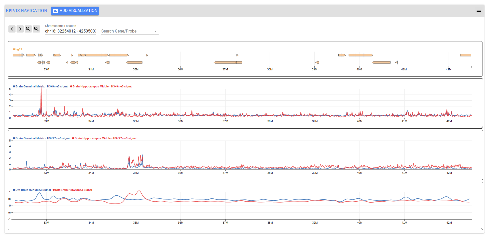

#### Interactively Query and Visualize Genomic data from flat files using Epiviz

- Define data sets (available locally or publicly) as a json configuration file - data.json

- Run the Epiviz File Server
    
    The epiviz python script allows users to load data from the configuration file and define transformations

    > $ python epiviz.py 

    more information on the file server is available at - [Documentation](https://epivizfileparser.readthedocs.io/en/latest/index.html) or [GitHub](https://github.com/epiviz/epivizFileParser)

- Epiviz Components allows users to interactively visualize and embed tracks on most web based platforms that support HTML.
    - First create a directory
    > $ mkdir epiviz && cd
    
    - Use bower to install dependencies
    > $ bower init
    
    > $ bower install epiviz/epiviz-chart

    - Create an index.html file to add Epiviz Components that query data from the Epiviz file server, more information on components is available at [GitHub](https://github.com/epiviz/epiviz-chart)

- Use Caddy or any web server to serve the Components
    > $ cd epiviz && caddy

